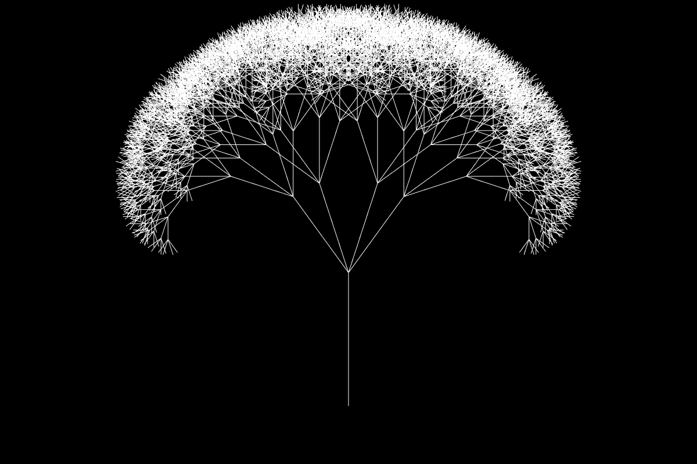

<p align="center">
  <a href="https://williamchyr.com/l-system/">
    
  </a>
</p>

# L-System Graphical Modeling

An L-system or Lindenmayer system is a parallel rewriting system and a type of formal grammar. An L-system consists of
an alphabet of symbols that can be used to make strings, a collection of production rules that expand each symbol into
some larger string of symbols, an initial "axiom" string from which to begin construction, and a mechanism for
translating the generated strings into geometric structures [[LINK]](https://en.wikipedia.org/wiki/L-system)

This project is a Python-based rendering or interpretation of L-systems as per the title **The Algorithmic Beauty
of Plants** by Przemyslaw Prusinkiewicz and Aristid
Lindenmayer [[Book]](http://algorithmicbotany.org/papers/abop/abop.pdf).

## Table of Contents

- [Installation](#installation)
- [Features](#features)
- [Usage](#usage)
- [Curves](#curves)
- [Support](#support)
- [License](#license)

## Installation

1. Clone this repository:
   ```bash
   git clone https://github.com/ambron60/l-system-drawing.git
   cd l-system-drawing
   ```

2. Create a virtual environment (recommended):
   ```bash
   python -m venv venv
   source venv/bin/activate  # On Windows: venv\Scripts\activate
   ```

3. Install dependencies:
   ```bash
   pip install -r requirements.txt
   ```

4. Run the application:
   - **Command-line interface**: `python lsystem.py`
   - **Web interface**: `streamlit run app.py`

## Features

### 🎨 **Dual Interface**
- **Command-line interface**: Interactive terminal-based fractal generator
- **Web interface**: Beautiful Streamlit web app with real-time visualization

### 🌱 **Built-in Presets**
- **Dragon Curve** - Complex space-filling curve (13 iterations)
- **Sierpinski Triangle** - Classic triangular fractal pattern
- **Koch Curve** - Snowflake-like fractal curve
- **Hilbert Curve** - Space-filling curve
- **Axial Tree** - Realistic plant growth simulation

### 🔧 **Advanced Features**
- **Type-safe code** with comprehensive type hints
- **Robust error handling** and input validation
- **Memory protection** for large sequences
- **Preset system** with easy selection (numbers or names)
- **Real-time complexity metrics** in web interface
- **Comprehensive logging** for debugging
- **Unit tests** with 25 test cases

### 📊 **Visualization Options**
- **Configurable plot parameters** (size, color, line width)
- **Statistics display** (sequence length, coordinate points)
- **High-quality matplotlib rendering**
- **Export capabilities** for generated fractals

L-systems lie at the heart of this project, enabling users to define custom rules for generating fractals. This project
supports any fractal pattern that can be represented by iterative rewriting rules, allowing for versatile and creative
fractal generation. Users can specify parameters such as step size, angle, and iteration depth, making it easy to
explore a wide range of fractal patterns, from plant-like structures to classic shapes such as the Dragon Curve or
Sierpiński Triangle.

## Usage

### 🌐 **Web Interface (Recommended)**
1. Run `streamlit run app.py`
2. Open your browser to the provided URL
3. Select a preset from the dropdown or create custom rules
4. Adjust parameters in the sidebar
5. Click "Generate L-System" to create your fractal

### 💻 **Command-line Interface**
1. Run `python lsystem.py`
2. Choose to use a preset or create custom rules
3. Follow the interactive prompts

#### **Using Presets (Easy Mode)**
```
L-System Fractal Generator
==============================
Use preset L-System? (y/n): y

Available presets:
  1. dragon_curve
  2. sierpinski_triangle
  3. koch_curve
  4. hilbert_curve
  5. axial_tree

Enter preset number (1-5) or name: 5
Using preset: axial_tree
```

#### **Custom Rules (Advanced Mode)**
```
Enter L-System rules in format 'symbol -> replacement' (enter '0' when done):
Enter rule[1]: F -> F[+F]F[-F]F
Enter rule[2]: 0
Enter axiom (starting sequence): F
Enter number of iterations: 5
Enter segment length: 1
Enter initial heading (degrees): 90
Enter angle increment (degrees): 25
```

> **Note**: The program now includes robust input validation and will guide you through any errors.

## Built-in Presets

| Preset | Axiom | Rules | Iterations | Angle | Description |
|--------|-------|-------|------------|-------|-------------|
| **Dragon Curve** | `FX` | `X -> X+YF+`, `Y -> -FX-Y` | 13 | 90° | Complex space-filling curve |
| **Sierpinski Triangle** | `F-G-G` | `F -> F-G+F+G-F`, `G -> GG` | 6 | 120° | Classic triangular fractal |
| **Koch Curve** | `F` | `F -> F+F-F-F+F` | 5 | 90° | Snowflake-like fractal curve |
| **Hilbert Curve** | `A` | `A -> -BF+AFA+FB-`, `B -> +AF-BFB-FA+` | 6 | 90° | Space-filling curve |
| **Axial Tree** | `X` | `X -> F-[[X]+X]+F[+FX]-X`, `F -> FF` | 6 | 22.5° | Realistic plant growth |

## Additional Examples

| Figure | Derivation |
|--------|------------|
| Koch Island | `F -> F-F+F+FF-F-F+F`, axiom=`F-F-F-F`, n=2, α₀=90°, angle=90° |
| Koch (1st variation) | `F -> FF-F-F-F-F-F+F`, axiom=`F-F-F-F`, n=3, α₀=90°, angle=90° |
| Koch Islands and Lakes | `F -> F+f-FF+F+FF+Ff+FF-f+FF-F-FF-Ff-FFF`, `f -> ffffff`, axiom=`F+F+F+F`, n=2, α₀=90°, angle=90° |
| Quadratic Snowflake | `F -> F+F-F-F+F`, axiom=`-F`, n=4, α₀=90°, angle=90° |
| Hexagonal Gosper curve | `L -> L+R++R-L--LL-R+`, `R -> -L+RR++R+L--L-R`, axiom=`L`, n=4, α₀=60°, angle=60° |

## Testing

The project includes comprehensive unit tests to ensure reliability:

```bash
python test_lsystem.py
```

**Test Coverage:**
- ✅ Core L-System functionality (derivation, coordinate generation)
- ✅ Rule parsing and validation
- ✅ Configuration management
- ✅ Preset system handling
- ✅ Error handling and edge cases
- ✅ Complex sequence generation

**Results:** 25 tests covering all major functionality with 100% pass rate.

## Recent Improvements

### 🚀 **Major Updates**
- **Enhanced Code Architecture**: Removed global state, added type safety, improved error handling
- **Dual Interface**: Both command-line and web-based interfaces
- **Built-in Presets**: 5 classic L-System patterns ready to use
- **Robust Input Validation**: Prevents crashes from invalid input
- **Comprehensive Testing**: 25 unit tests with 100% pass rate
- **Memory Protection**: Prevents excessive memory usage with large sequences
- **Improved User Experience**: Numbered preset selection, clear error messages

### 🔧 **Technical Improvements**
- **Type Hints**: Complete type annotations for better code maintainability
- **Error Handling**: Custom exceptions and graceful error recovery
- **Logging**: Structured logging for debugging and monitoring
- **Configuration Management**: Dataclass-based parameter management
- **Performance**: Optimized coordinate generation and sequence handling

## Support

For questions or comments:

- Author: **Gianni Perez** @ [skylabus.tech](https://www.skylabus.tech) or at gianni.perez@gmail.com
- [](http://www.linkedin.com/gianni-perez)

**Live Demo:** [https://l-systems-and-fractals.streamlit.app/](https://l-systems-and-fractals.streamlit.app/)

## License

[](https://github.com/ambron60/l-system-drawing/blob/master/LICENSE.md)
